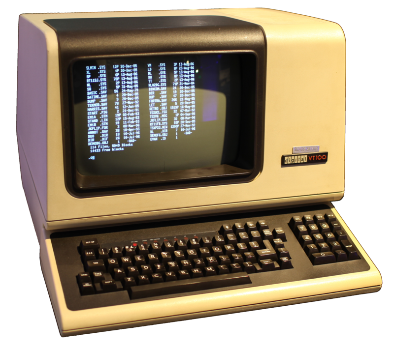

# Introduction
If you go into the Internet and ask around you will see that several terms appear when asking about Bash. Some of them are:
* Terminal
* Terminal Window
* Console
* Shell

In this section we are going to learn the important terms for us and how they are related to each other. So let’s start!

## What is a Terminal or Console?
Back in the days before personal computers, there were time-sharing systems (computers so big that occupied complete rooms). Users needed to connect to them via special dedicated devices. These devices were typically composed of a keyboard (that allowed the user to input instructions to the computer) and a text-only display monitor (that would show the input coming from the user and the output coming from the computer).

<div style="text-align:center">
    
</div>

This kind of device received a couple of names that were inspired by electronics and furniture. These terms are “*terminal*” and “*console*”.

The “**terminal**” word came by analogy to electrical engineering where a terminal is a connector on the end of a wire that lets you access electrical signals with some kind of test equipment.

The “**console**” word came by analogy to a console table.

Both of these terms are typically used to refer to physical devices.

In January 1984, Apple released the **Macintosh 128K** (aka “*Apple Macintosh*”) and it opened a new world to computer users. Prior to this release, virtually all computer displays were consoles. Starting from this point we can start talking about Terminal Windows and Shells.

## What is a Terminal Window?
With the arrival of a GUI (Graphic User Interface) for an OS (Operating System) comes the term “Terminal Window”.

A Terminal Window is a text-only window in the GUI that emulates a console.

A terminal window lets you interact with a Shell.

## What is a Shell?
In software engineering, a shell is a program or environment that provides an interface for users to interact with an operating system (OS). It acts as a command-line interpreter, allowing users to execute commands and run programs by typing text-based commands.

The shell acts as a user's primary interface to the operating system, facilitating the execution of various tasks, such as running programs, managing files and directories, manipulating data, and controlling system resources.

A shell typically provides features such as command parsing, command execution, input/output redirection, piping, scripting capabilities, and variable management. It interprets the commands entered by the user and translates them into system calls or executable programs.

Different operating systems have different shells. For example, Unix-based systems like Linux often use the Bash (Bourne Again SHell) as the default shell, while other popular shells include Zsh (Z Shell) and Fish (Friendly Interactive SHell). Windows operating systems commonly use the Command Prompt (cmd.exe) or PowerShell as shells.

Shells are powerful tools for automating tasks, performing system administration, writing scripts, and managing software applications. They provide a flexible and efficient way to interact with the underlying operating system, making them essential components for software engineers, system administrators, and power users.

## What is Bash (Bourne Again Shell)?
Bash (Bourne Again Shell) is the free and enhanced version of the Bourne shell distributed with Linux and GNU operating systems.

This Bash shell comes with a very powerful scripting language that allows you to deal with tasks of your Linux/GNU operating system in a very efficient way, when known BASH Scripting properly.

## Why learning Bash?

Learning Bash can be very useful for multiple reasons.

Bash scripting allows you to **automate** repetitive tasks, saving time and effort. You can write scripts to perform complex tasks, execute a series of commands, or handle file operations, making it easier to manage and control your system.

Bash is widely used in **system administration** tasks on Linux and Unix-based systems. With Bash, you can write scripts to configure and manage servers, monitor system resources, handle backups, and perform various administrative tasks.

Bash provides a **powerful command-line interface** (CLI) that allows you to navigate the file system, manipulate files and directories, execute commands, and perform text processing. By learning Bash, you can become more efficient and productive when working in a command-line environment.

Bash is **available** on most Unix-based systems, including Linux[^1], macOS, and even Windows through tools like WSL (Windows Subsystem for Linux). By learning Bash, you acquire a portable skill set that can be applied across different platforms, making it easier to work with a variety of systems.

Bash scripting allows you to create complex scripts by combining control structures, variables, loops, conditional statements, and functions. This **flexibility** enables you to solve problems and automate tasks in creative ways.

Bash seamlessly **integrates with other command-line tools and utilities**, such as grep, sed, awk, and many others. By combining Bash with these tools, you can build powerful command-line pipelines and perform complex data manipulation and analysis tasks.

Bash has a **large and active community of users**, which means there is an abundance of resources, tutorials, forums, and examples available online. Learning Bash provides access to this wealth of knowledge and support, making it easier to troubleshoot issues, expand your skills, and collaborate with others.

Proficiency in Bash scripting is **highly valued in various fields**, including system administration, DevOps, software development, and cybersecurity. By learning Bash, you open up opportunities for career advancement and increase your marketability in the job market.

Overall, learning Bash empowers you with the ability to automate tasks, efficiently manage systems, navigate the command line, and leverage a wide range of tools and resources. It is a valuable skill for anyone working with Linux or Unix-based systems and provides a solid foundation for further exploration of scripting and automation.

## Is Bash easy to Learn?
Bash is generally considered to be relatively easy to learn, especially for individuals with prior experience in command-line environments or programming concepts. There are, of course, a few factors that contribute to the perceived ease of learning Bash.

Bash has a **straightforward and readable syntax**. Its syntax is closer to natural language and does not require complex constructs or punctuation. Basic Bash commands and constructs are often intuitive and easy to understand.

Bash is a **widely used shell** with a large user base and extensive documentation available. There are numerous tutorials, guides, forums, and examples online that can assist beginners in learning Bash and solving common problems.

If you are already familiar with working in a command-line environment, learning Bash can be even easier. Many concepts and commands used in Bash are similar to those found in other Unix-like shells, making the transition smoother.

Bash provides **immediate feedback** on the command line. You can execute commands directly and observe their results immediately, allowing for quick iterations and learning by experimentation.

Bash allows you to **start with simple commands and gradually progress** to more complex scripts as you gain proficiency. You can begin by executing commands interactively and then move on to writing simple scripts, gradually adding more advanced features and constructs.

Bash is **available on most Unix-like systems**, including Linux and macOS, which makes it highly versatile and widely used. Its ubiquity means that learning Bash opens up opportunities to work with a vast range of systems and environments.

While Bash itself is generally considered easy to learn, mastery of more advanced scripting concepts and techniques may require additional time and practice. However, for basic command execution and simple scripting tasks, Bash can be a user-friendly and accessible language to start with.

In the next section we are going to see the classical example of software engineering. The “Hello World!” for Bash.

## Hello world!
The following script contains 3 lines of code that prints on the screen the message “Hello World!”. Just bear in mind that the numbers that appear at the beginning of each line are not required. Those numbers are added to be able to refer to specific lines inside the script.

```bash
 1 #!/bin/bash
 2 #Script: hello_world.sh
 3 echo "Hello World!"
```

Once you have the previous script saved to a file named “`hello_world.sh`” you need to give them permissions to be able to execute it without the “bash” command.

In order to give permissions to execute you need to run the following command.
```shell
$ chmod +x hello_world.sh
```

Once the previous command is executed you will be able to execute the script as follows.

```shell
$ ./hello_world.sh
Hello World!
$
```

If you do not give permissions for execution to your script you will have to execute it with the “bash” command, like the following.
```shell
$ bash hello_world.sh
Hello World!
$
```

For the rest of the book we are going to assume that you are going to give permissions for execution to your scripts.

## Summary
In this chapter we learnt what the motivations are to learn Bash.

Bash is a widely used shell and can be valuable for different positions like (but not limited to) software engineer, DevOps engineer, system administrator, data scientist and many more.

Bash, if learnt properly, will make you more effective as you will be able to automate tasks efficiently.

Along the rest of the book we are going to learn the ins and out of Bash and its associated scripting language.

I hope you will enjoy the rest of the book. Have fun!

## References
* http://www.linfo.org/console.html
* http://www.linfo.org/terminal_window.html
* http://www.linfo.org/shell.html


[comment]: <> (footnotes)

[^1]: The following list of Linux distributions come by default with Bash: Ubuntu, Debian, CentOS, Fedora, openSUSE, Arch Linux, Linux Mint, Red Hat Enterprise Linux (RHEL), Oracle Linux, Gentoo, Slackware, Kali Linux, Elementary OS, Zorin OS, Manjaro, Mageia, and many more

