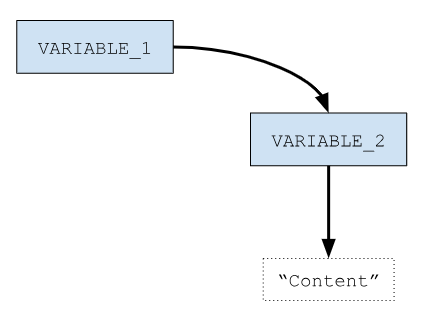

# Variables
Think of a variable like a labeled container or storage box in your room. You can use these containers to keep different things organized.

Now, in the world of computers and programming, a variable is a bit like one of these containers. It's a named spot in the computer's memory where you can store information. This information can be all sorts of things, like numbers, words, or even more complex data.

For instance, let's say you're writing a computer program to keep track of your favorite books. You can create a variable called "`favoriteBook`" and put the name of your current favorite book in it. Then, whenever you want to know which book is your favorite at the moment, you just look inside that "`favoriteBook`" container, and there it is!

Variables are incredibly handy because they let you store and manipulate data as your program runs. You can change what's inside the container whenever you like, and your program can use that information to do all sorts of cool things. 

So, in a nutshell, a variable is like a labeled box for holding different types of information in a computer program.

## How do you declare a variable in Bash?
The minimum syntax required to create a variable is as follows.

```bash
myVar=”some value”
```

If you use “`myVar`” only, Bash will think you are invoking a command and will fail if there is no command named “`myVar`”<a id="footnote-1-ref" href="#footnote-1">[1]</a>.

## How do you read a variable in Bash?
Once the variable  has a value assigned to it, we can read from the variable by using the character “`$`” right before the name of the variable. 

Let’s take a look to an example.

```bash
 1 #!/usr/bin/env bash
 2 #Script: read_variable.sh
 3 myVariable=1234
 4 echo "The value of myVariable is $myVariable"
```

Sometimes you will see the variables referenced like “`${myVariable}`”. These two ways (“`$myVariable`” and “`${myVariable}`”) to access the variable are equivalent. The longer form (meaning “`${myVariable}`”) is more powerful as it allows other operations (like length, replacement or substring) as we will see later in another chapter.

## First limitation and how to overcome it?
In bash, by default, variables are strings of characters (Something like `“hello world”`). The way to work around this limitation is by using the “`declare`/`typeset`” builtin commands.

### Limitation Example
In Bash Scripting, variables per se are not strongly typed as in other languages (like C, C++, Java, etc). They are basically strings and, depending on the context, some operations are allowed.

```bash
 1 #!/usr/bin/env bash
 2 #Script: limitation_example.sh
 3 # Integer variable
 4 myInteger=123
 5 echo "Value of myInteger is ${myInteger}"
 6 # Float variables
 7 myFloat=10.34
 8 echo "Value of myFloat is $myFloat"
 9 # String variable
10 myString="My String variable"
11 echo "Value of myString is $myString"
```

In the previous script, if you wanted to do some numerical operations with the first two variables (“`myInteger`” and “`myFloat`”) the result of the operation would not be numerical.

Let’s see it with the following example.

```bash
 1 #!/usr/bin/env bash
 2 #Script: limitation_example_2.sh
 3 myVariable=123
 4 myVariable=$myVariable+1
 5 echo "Value: $myVariable"
```

When you execute the previous script you will get the following output.

```shell
$ ./limitation_example_2.sh
Value: 123+1
```

As you can see the output of the script is `123+1` and not `124`.

In the next section we will learn how to give “*semantic meaning*” to the declared variable so that the numerical operations just work.

### How to give specific semantics to the variables declared? (`declare`/`typeset` to the rescue)
The “`declare`” (or “`typeset`”) builtin command is used to declare variables and give them attributes. You could think about it as some kind of weak typing.

The way we use “`declare`” is with the following syntax:

```txt
declare <flag> <NAME>
```

The following table contains a list of flags and the behavior that the flag will give to the variable declared.

|Flag|Description|
|:----:|:----|
|`-a`|If supported, it will make “`<NAME>`” behave like an indexed array|
|`-A`|If supported, it will make “`<NAME>`” behave like an associative array|
|`-i`|It will make “`<NAME>`” behave like an integer|
|`-l`|It will convert the value of “`<NAME>`” to lowercase on assignment|
|`-n`|The “`<NAME>`” declared with this flag will reference the variable which name is the value of the “`<NAME>`” variable|
|`-p`|Displays how the variable “`<NAME>`” was declared and its value. The output contains the flag that was used (“`-a`” for arrays, “`-A`” for associative arrays and so on)|
|`-r`|It will make the variable “`<NAME>`” read only. It will make the variable a constant.|
|`-t`|It will enable the “*trace*” attribute. Very useful when used in combination with the “`trap`” command to debug scripts. We will learn more about the “`trap`” command in a later chapter.|
|`-u`|It will convert the value of “`<NAME>`” to uppercase on assignment|
|`-x`|It’s used to export the variable|

Let’s see a couple of examples, shall we?

The first example is about giving a variable the behavior of an integer. Let’s take a look at the following example script.

```bash
 1 #!/usr/bin/env bash
 2 #Script: declare_i.sh
 3 declare -i myVariable=123  # <<< Declaration
 4 myVariable=$myVariable+1
 5 echo "Value: $myVariable"
```

In this script we are declaring the variable “`myVariable`” as an integer. This means that starting from this point any operation that we will do with it will not be treated as a string operation but as an integer operation.

When you execute the previous script you will get the following result.


```shell
$ ./declare_i.sh
Value: 124
```

Let’s see another example using a different flag. 

In this case we are going to use the “`-l`” flag. The description of the previous table says that “*It will convert the value of “`<NAME>`” to lowercase on assignment*”.

Let’s see how it works with the following script.

```bash
 1 #!/usr/bin/env bash
 2 #Script: declare_l.sh
 3 declare -l MY_VAR="This is UPPERCASE"
 4 MY_VAR_2=$MY_VAR
 5 echo "MY_VAR  : $MY_VAR"
 6 echo "MY_VAR_2: $MY_VAR_2"
```

As you can see, the value of the variable “`MY_VAR`” contains both lowercase and uppercase characters. But as we have declared the variable with the “`-l`” flag this means that every time this variable is read, the values read from it will always be in lowercase.

Let’s see what happens when we run the script.

```shell
$ ./declare_l.sh
MY_VAR  : this is uppercase
MY_VAR_2: this is uppercase
```

What we can see from the execution of this script is that the variable “`MY_VAR`” is read directly in the first “`echo`” command, and is read from another variable (“`MY_VAR_2`”) which was assigned the value of the first one.

With this example we can conclude that at any moment when the variable “`MY_VAR`” is read, it will first transform its contents to lowercase before giving it to another variable or being used in a replacement.

In a later chapter we will come back to the “`declare`” command.

## How to delete declared variables?

There might be moments in which you want to get rid of some data stored in a variable because it takes space and is no longer needed. You can achieve this with the “`unset`” command.

By writing “`unset variableName`” it will release the memory associated with that variable.

Let's see how it works with the following example.

```bash
 1 #!/usr/bin/env bash
 2 #Script: unset_variable.sh
 3 myLargeVariable="abcdefghijklmnopqrstuvwxyz..."
 4 echo "Variable: '${myLargeVariable}'"
 5 echo "Unsetting variable"
 6 unset myLargeVariable
 7 echo "Variable unset"
 8 echo "Variable: '${myLargeVariable}'"
 9 echo "End of Program"
```

When you execute the previous script you will get the following output.

```shell
$ ./unset_variable.sh
Variable: 'abcdefghijklmnopqrstuvwxyz...'
Unsetting variable
Variable unset
Variable: ''
End of Program
```

As you can see in the output of the script, after the `unset myLargeVariable` is executed the variable will no longer exist.

In the next section we will learn how to declare "constants".

## How to declare constants? (`declare -r` or `readonly`)
Just to refresh, a constant is a value (a variable) that should not be altered by the program during the execution. A constant can be anything you think of:
* A String with a message
* A mathematical constant like PI
* The number of bytes or characters your program will take as input
* It could be whatever comes to your mind. You name it!

In Bash there are two ways to declare constants variables.

The first way is to use `declare -r` before the constant. 

The second way is to use `readonly` before the constant.

As we mentioned before, the “`declare`” (or `readonly`) builtin command is used to modify some properties of the variables we declare in our script. This command can be used to declare variables as “*read only*” which will make them constants.

Let's see an example using both ways.

```bash
 1 #!/usr/bin/env bash
 2 #Script: declare_readonly.sh
 3 readonly myReadOnlyVariable="Constant Value"
 4 echo "Value of first constant is: $myReadOnlyVariable"
 5 myReadOnlyVariable="Another constant value"  # this will fail
 6 declare -r myOtherReadOnlyVariable="Other Constant Value"
 7 echo "Value of second constant is: $myOtherReadOnlyVariable"
 8 myOtherReadOnlyVariable="Another Constant Value" # this will fail as well
```

When you execute the previous script, you will get the following result.

```shell
$ ./declare_readonly.sh
Value of first constant is: Constant Value
./declare_readonly.sh: line 7: myReadOnlyVariable: readonly variable
Value of second constant is: Other Constant Value
./declare_readonly.sh: line 12: myOtherReadOnlyVariable: readonly variable
```

As you can see from the output of the execution of the script Bash is warning you that on lines 7 and 12 there is a "problem" as you are trying to override the value of a constant.

## Variables with `$'...'` format
Words of the form `$'string'` are treated specially. The word expands to string, with backslash-escaped characters replaced as specified by [the ANSI C standard](https://www.gnu.org/software/bash/manual/html_node/ANSI_002dC-Quoting.html).

Let's see an example directly in the terminal.

```shell
$ echo $'This\nIs really\nIMPORTANT'
This
Is really
IMPORTANT
```

As you can see from the output the terminal is interpreting the escaped characters (in our case the new line characters).

In the next section we will talk about "*Indirect Variables*"

## Indirect Variables
Bash is provided with a way to do “*indirection*”. The concept of “*indirection*” is to store in a variable a reference to another one which contains the value we are interested in.

Indirect variables are a powerful feature that allows you to work with variable names indirectly, making your scripts more dynamic and flexible. They are particularly useful in scenarios where you need to generate variable names or dynamically access variables based on user input or other runtime conditions.

The syntax to be used is the following.

```
${!VARIABLE}
```

What Bash is going to do is to replace “`!VARIABLE`” with the contents of “`VARIABLE`”, which is supposed to be the name of another variable (let’s say, “`VARIABLE_2`”), and then it will be interpreted as “`${VARIABLE_2}`”, which will result in the contents of “`VARIABLE_2`”.

Let's say that we have the following script.

```bash
 1 #!/usr/bin/env bash
 2 #Script: indirect_variable.sh
 3 VARIABLE_2="Content"
 4 VARIABLE_1=VARIABLE_2
 5 echo "Value: ${!VARIABLE_1}"
```

In the previous simple script we are declaring a variable named “`VARIABLE_2`” with the content `“Content”`. After that we are declaring a variable named “`VARIABLE_1`” with the content “`VARIABLE_2`”.

In the line 5 of the previous script, the redirection happens. In the following diagram you will see a representation of what is actually happening.

<div style="text-align:center">
    
</div>

## Summary

In this chapter we learnt a lot about variables.

We learnt:
* How to declare variables.
* How to read the content of the variables.
* About some limitations and how to give semantics to the variables.
* How to delete variables (`unset`).
* How to declare constants (`declare -r` or `readonly`).
* How to work with `$'...'` strings.
* About Indirect Variables

Take some time to practice the different concepts we saw in this chapter.

"*Practice makes perfect*".

## References
* https://ryanstutorials.net/bash-scripting-tutorial/bash-variables.php
* https://tldp.org/HOWTO/Bash-Prog-Intro-HOWTO-5.html
* https://tldp.org/LDP/Bash-Beginners-Guide/html/sect_03_03.html
* https://www.gnu.org/software/bash/manual/html_node/ANSI_002dC-Quoting.html
* https://www.howtogeek.com/442332/how-to-work-with-variables-in-bash/


<hr style="width:100%;text-align:center;margin-left:0;margin-bottom:10px;">
<p id="footnote-1" style="font-size:10pt">
1. For now :wink:.<a href="#footnote-1-ref">&#8617;</a>
</p>

