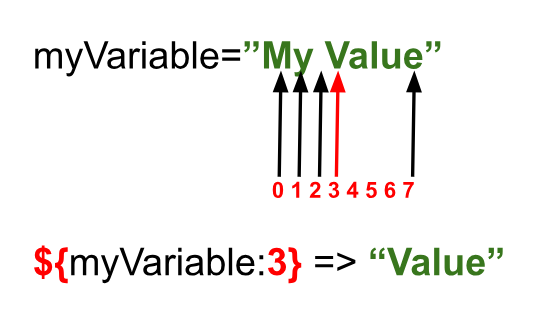
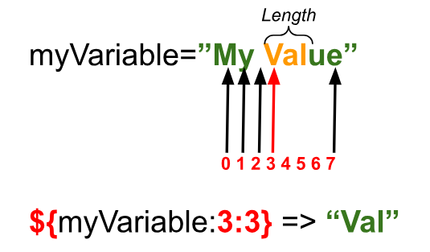
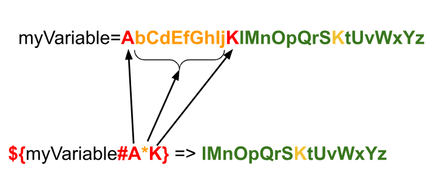
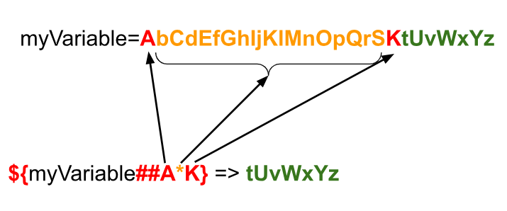
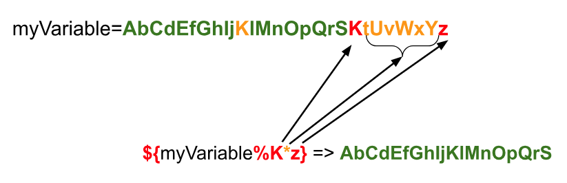
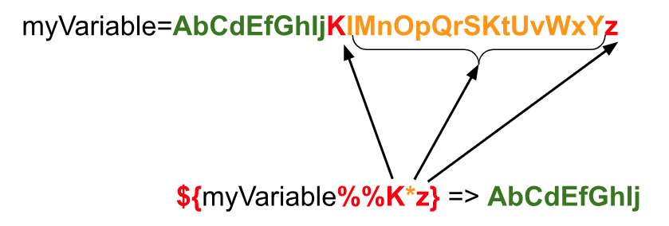
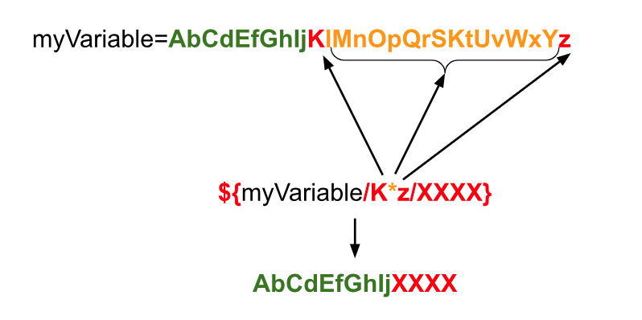
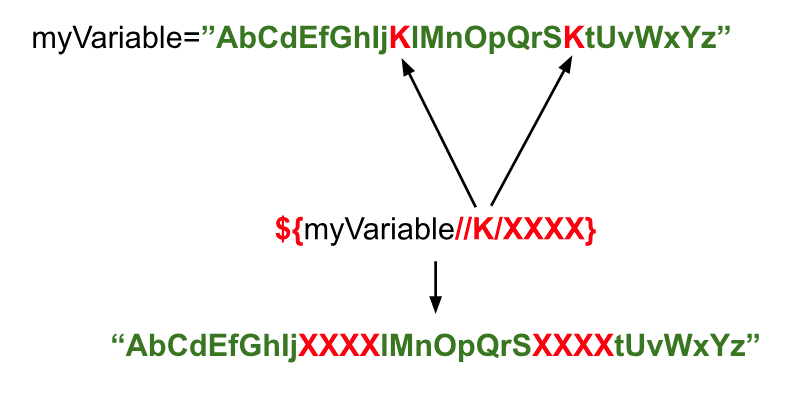

# Working with Strings
In software engineering, we use the term "*strings*" to talk about a sequence of characters, like letters, numbers, or symbols, that are grouped together. Think of a string as a word or a sentence, just like the ones you use when texting your friends.

For example, the word "`hello`" is a string. It's a series of characters - `'h'`, `'e'`, `'l'`, `'l'`, `'o'` - that are strung together to make a word. But strings can be much longer than just one word; they can be as short as one character or as long as an entire book!

We use strings in software for lots of things. We might use them to store your name, to display messages on a computer screen, to read data from a file, or to send information over the internet. So, in a nutshell, strings in software are just like words or sentences made up of characters, and they're super important for all kinds of computer programs.

In this chapter we will learn about strings.

## How to declare a String?

There are three main ways to declare a string in Bash.

The first way of declaring a string in bash has the following syntax.

```bash
myVariable=myValue
```

In this case you see that there are no quotes around “`myValue`”. Let's see a simple example.

```bash
 1 #!/usr/bin/env bash
 2 #Script: declare_string.sh
 3 myVariable=myValue
 4 echo "Variable: $myVariable"
```

When you execute the previous script you will get the following output.

```txt
$ ./declare_string.sh
Variable: myValue
```

It has to be a single sequence of characters with no space in it. If you add a space in the value of the string, Bash will understand that the string after the space is a command and will try to execute the command. Let's see it with the following example.

```bash
 1 #!/usr/bin/env bash
 2 #Script: declare_string_wrong.sh
 3 myVariable=myValue otherString
 4 echo "Variable: $myVariable"
```

As you can see in the line 3 there is the string `otherString` after the space character. When you execute the previous script you will get the following output.

```txt
$ ./declare_string_wrong.sh
./declare_string_wrong.sh: line 3: otherString: command not found
Variable:
```

Also in this category of declaring strings you could also attach another variable at the end like in the following example.

```bash
myVariable=myValue$myOtherVariable
```

This way will build a single string that starts with `myValue` and appends the contents of the `myOtherVariable` variable creating a single string whose value will be assigned to the variable `myVariable`.

The second way is to **use double quotes** to allow spaces within our string. The syntax of this approach is as follows.

```bash
myVariable=”my value”
```

Let's see a very simple example with the next script.


```bash
 1 #!/usr/bin/env bash
 2 #Script: declare_string_with_double_quotes.sh
 3 myVariable="This is a string that contains 8 space characters"
 4 echo "Variable: $myVariable"
```

When you execute the previous script you will get the following result.

```txt
$ ./declare_string_with_double_quotes.sh
Variable: This is a string that contains 8 space characters
```

In this case, the value of the string can contain spaces and will expand the values of other variables referenced. In the following example you will see that the value of the variable “`myVariable`” references another variable called “`value`”.

```bash
myVariable=”This $value will be replaced”
```

Let's see how this works with an example script.

```bash
 1 #!/usr/bin/env bash
 2 #Script: declare_string_that_references_another_variable.sh
 3 value="a string that contains"
 4 myVariable="This is $value 8 space characters"
 5 echo "Variable: '$myVariable'"
```

As you can see in the previous script there is a variable named `value` declared in line 3, then the contents of that variable are used in the line 4 to declare the variable named `myVariable`.

When you execute the previous script you will get the following output.

```txt
$ ./declare_string_that_references_another_variable.sh
Variable: 'This is a string that contains 8 space characters'
```

The last way to declare a variable is similar to the previous one but we **use single quotes instead of double quotes**. 

```bash
myVariable=’This $value will be replaced’
```

The main difference between using single quotes and using double quotes is that if there is any reference to variables inside a single quoted string will never be replaced the contents of the variables will never be added to the string, you will only see the variable reference as it is. Let's see it with the following example.

```bash
 1 #!/usr/bin/env bash
 2 #Script: declare_string_with_single_quotes.sh
 3 value="string that contains"
 4 myVariable='This is a $value 8 space characters'
 5 echo "Variable: $myVariable"
```

Depending on the syntax highlighting you are using you might see that the variable referenced in the line 4 of the previous script you might notice that color of the `$value` is no longer highlighted. If you execute the previous script you will have the following output.

```txt
$ ./declare_string_with_single_quotes.sh
Variable: This is a $value 8 space characters
```

As you can see the contents of the variable `value` are not included in the string for the variable `myVariable`.

Now that we know how to declare a string in the next sections we will learn how to extract information from them (length or substrings) and how to combine strings with other strings.

## String length
So now that we know how to declare string variables, we are going to learn some of the basic operations we can do with them. Let’s start!

The first thing that we are going to learn about string is how to get the length of a string. For that we need to use the following syntax.

```bash
${#myVariable}
```

This operator returns the length of the string contained in the variable called “`myVariable`”. Let’s see it with an example in the following script.

```bash
 1 #!/usr/bin/env bash
 2 #Script: string_length.sh
 3 myVariable="My Value"
 4 echo "The content of ‘myVariable’ is '$myVariable' and its length is ${#myVariable}"
```

When you execute the previous script you will get the following output in the terminal.

```txt
$ ./string_length.sh
The content of ‘myVariable’ is 'My Value' and its length is 8
```

In the previous execution you can see that script prints a string with the name of the variable (“`myVariable`”), the content of the variable (“`My Value`”) and the length of the content of the variable (8 characters long).

Now that we know how to extract the length of a string variable we are going to change the topic to learning how to extract substrings from a given string variable.

## Substrings

There are several ways to extract a portion of a string that is contained in a variable. It can be done either using the indices of the string or using pattern matching to remove parts of the string. Let’s see one by one with examples.

When we are using the indices of a string we can use two ways. 

```bash
${myVariable:index}
```

Or.

```bash
${myVariable:index:length}
```

The first option generates a substring starting from the character at the position “`index`” until the end of the string. Let’s see what happens with an example.

```bash
 1 #!/usr/bin/env bash
 2 #Script: string_index.sh
 3 myVariable="My Value"
 4 echo "Substring: ${myVariable:3}"
```

When you execute the previous script you will get the following result.

```txt
$ ./string_index.sh
Substring: Value
```

In the previous execution the script prints as output the substring “Value”. Why is that? In the following diagram we give a visualization of why this is happening.

<div style="text-align:center">
    
</div>

As you can see in the previous diagram, the operator “`${myVariable:3}`” retrieves the substring starting from the 4th character (the one that has index 3).

In the second form that we mentioned before (`${myVariable:index:length}`), we can use the length of the substring that we want to extract starting from the index. Let’s see an example.

```bash
 1 #!/usr/bin/env bash
 2 #Script: string_index_length.sh
 3 myVariable="My Value"
 4 echo "Substring: ${myVariable:3:3}"
```

When you execute the previous script you will have the following result.

```txt
$ ./string_index_length.sh
Substring: Val
```

Same as with the previous example we include the following diagram to give a more visual explanation of what is happening.

<div style="text-align:center">
    
</div>

In this case it starts as with the previous example, selecting the beginning of the string from the fourth character (character with index 3) and will take a length of 3 characters starting from the character “`V`” included. Resulting in the substring “`Val`”.

Now that we have already learnt how to extract substring from a string variable with index and length, it’s time to explore and learn about extracting substring by removing a pattern that we don’t want to have in the substring.

## Remove some parts of a string

In Bash you can use some string operators to remove a part of a string that matches a given pattern.

There are **four different ways** to remove patterns to generate a substring depending on if we want to search for the longest (or shortest) pattern and if we want to start from the beginning of the string (or from the end). Let’s explore each one of them!

### Remove shortest substring starting from the front

The first way is removing the **shortest** substring that matches a pattern **starting from the front** of the string. For that we need to use the following syntax.

```bash
${myVariable#substring}
```

In the following diagram you will see that Bash will search for the shortest substring that matches the pattern provided (from the beginning of the string) and will generate a substring without the part that matches the pattern to be removed.

<div style="text-align:center">
    
</div>

### Remove longest substring starting from the front

The second way is removing the **longest** substring that matches a pattern **starting from the front** of the string. For that we need to use the following syntax.

```bash
${myVariable##substring}
```

In the following diagram you will see that Bash will search for the longest substring that matches the pattern provided (from the beginning of the string) and will generate a substring without the part that matches the pattern to be removed.

<div style="text-align:center">
    
</div>

Please notice in the previous diagram that between the red letters there are two different `K` characters. As we are using the operator to remove the **longest** sequence of characters that matches the given pattern it will remove the longest sequence of characters.

### Remove shortest substring starting from the back
The third way is removing the **shortest** substring that matches a pattern **starting from the back** of the string. For that we need to use the following syntax.

```bash
${string%substring}
```

In the following diagram you will see that Bash will search for the shortest substring that matches the pattern provided (from the back of the string) and will generate a substring without the part that matches the pattern to be removed.

<div style="text-align:center">
    
</div>

### Remove longest substring starting from the back
Last, but not least, is removing the **longest** substring that matches a pattern **starting from the back** of the string. For that we need to use the following syntax.

```bash
${string%%substring}
```

In the following diagram you will see that Bash will search for the longest substring that matches the pattern provided (from the back of the string) and will generate a substring without the part that matches the pattern to be removed.

<div style="text-align:center">
    
</div>

### Example
In the following script we put together an example of every way we talked about in this section.

```bash
 1 #!/usr/bin/env bash
 2 #Script: remove_substring_examples.sh
 3 myVariable=AbCdEfGhIjKlMnOpQrSKtUvWxYz
 4 # Remove shortest substring starting from the front
 5 echo "\${myVariable#A*K}  => ${myVariable#A*K}"
 6 # Remove longest substring starting from the front
 7 echo "\${myVariable##A*K} => ${myVariable##A*K}"
 8 # Remove shortest substring starting from the back
 9 echo "\${myVariable%K*z}  => ${myVariable%K*z}"
10 # Remove longest substring starting from the back
11 echo "\${myVariable%%K*z} => ${myVariable%%K*z}"
```

When you execute the previous script you will get the following output.

```txt
$ ./remove_substring_examples.sh
${myVariable#A*K}  => lMnOpQrSKtUvWxYz
${myVariable##A*K} => tUvWxYz
${myVariable%K*z}  => AbCdEfGhIjKlMnOpQrS
${myVariable%%K*z} => AbCdEfGhIj
```

Now that we are done learning how to get substrings we are going to change the topic and dive into substring replacement. Let’s go!

## Substring Replacement
Substring replacement in Bash is a powerful feature that allows you to find and replace parts of a string (a sequence of characters) with another string. It's like doing a search-and-replace operation but within a text stored in a variable.

There are two ways to do a substring replacement in Bash. The first one is to replace only the first match and the second one is replacing all the matches.

### Replace the first match
To replace the **first match** of the pattern provided we need to use the following syntax.

```bash
${string/pattern/replacement}
```

In the following diagram you will see that Bash will search for the longest substring that matches the pattern provided (from the front of the string) and will generate a substring with “`pattern`” replaced by “`replacement`”.

<div style="text-align:center">
    
</div>

### Replace all matches
To replace **all the matches** of the patterns provided we need to use the following syntax.

```bash
${string//pattern/replacement}
```

In the following diagram you will see that Bash will search for the longest substring that matches the pattern provided (from the front of the string) and will generate a substring with “`pattern`” replaced by “`replacement`” in all instances of the match.

<div style="text-align:center">
    
</div>

### Example

In the following script you will see a couple of examples for each type of replacement.

```bash
 1 #!/usr/bin/env bash
 2 #Script: substring_replacement.sh
 3 myVariable=AbCdEfGhIjKlMnOpQrSKtUvWxYz
 4 # Replace the first instance
 5 echo "\${myVariable/A*K/XXXX}  => ${myVariable/A*K/XXXX}"
 6 # Replace the first instance
 7 echo "\${myVariable/K*z/XXXX}  => ${myVariable/K*z/XXXX}"
 8 # Replace all instances
 9 echo "\${myVariable//A*K/XXXX} => ${myVariable//A*K/XXXX}"
10 # Replace all instances
11 echo "\${myVariable//K/XXXX}   => ${myVariable//K/XXXX}"
```

When you execute the previous script you will get the following result.

```txt
$ ./substring_replacement.sh
${myVariable/A*K/XXXX}  => XXXXtUvWxYz
${myVariable/K*z/XXXX}  => AbCdEfGhIjXXXX
${myVariable//A*K/XXXX} => XXXXtUvWxYz
${myVariable//K/XXXX}   => AbCdEfGhIjXXXXlMnOpQrSXXXXtUvWxYz
```

Now that we are done with string replacement we are going to change the topic again. In the next section we will learn how to convert a given string to uppercase or lower case.

## Uppercase / Lowercase
Bash provides you with a couple of operators to allow you to convert strings that contain alphabetic characters to uppercase (`A`, `B`, `C`, `D`…) or lowercase (`a`, `b`, `c`, `d`…).

To be able to convert your string to uppercase you need to use the following operator.

```bash
${myStringVariable^^}
```

You can think of this operator as a way to tell Bash to make the alphabetic characters “*bigger*”. Being the “`^^`” operator, the one saying something like “*Make it bigger*” with those two arrows pointing up.

In a similar way, for you to be able to convert your string to lowercase you need to use the following operator.

```bash
${myStringVariable,,}
```

In this case the two commas are telling Bash to make the alphabetic characters “*smaller*”. Being the “`,,`” operator, the one saying something like “*Make it smaller*” with those commas pointing down.

In the following example you will see how both operators work.

```bash
 1 #!/usr/bin/env bash
 2 #Script: string_upper_lower.sh
 3 myStringVariable="This is the message that I want to test"
 4 # Original String
 5 echo "Original : $myStringVariable"
 6 # UPPERCASE STRING
 7 echo "UPPERCASE: ${myStringVariable^^}"
 8 # lowercase string
 9 echo "lowercase: ${myStringVariable,,}"
```

When you execute the previous script you will get the following output.

```txt
$ ./string_upper_lower.sh
Original : This is the message that I want to test
UPPERCASE: THIS IS THE MESSAGE THAT I WANT TO TEST
lowercase: this is the message that i want to test
```

Now that we are done with these couple of operations we are going to tackle what I consider to be one of the most important operations with strings, which is concatenation. 

Let’s go for it! :wink:

## Concatenation
If you have tried other programming languages, the operators that you have used to concatenate strings are, most likely, the “`+`” operator and the “`+=`” operator.

Unfortunately the operator “`+`” is of no use for us while the operator “`+=`” does the same as in other programming languages. Out of curiosity, let’s see what happens when we try to use the “`+`” operator to concatenate two different strings. In the following script you will see the example.

```bash
 1 #!/usr/bin/env bash
 2 #Script: string_invalid_concatenation.sh
 3 firstName="John"
 4 lastName="Doe"
 5 # Concatenation
 6 fullName=$firstName+$lastName
 7 echo "Concatenation: $fullName"
```

In the previous script you see that on lines 3 and 4 there are two strings declared. Then on line 6 you see that we declare a variable that contains the (invalid) concatenation of the previous two strings. According to our logic that we saw in other programming languages the variable “`fullName`” should contain the value “`JohnDoe`”.

When you run the previous script you will see that the reality is different.

```txt
$ ./string_invalid_concatenation.sh
Concatenation: John+Doe
```

What is happening here is that Bash takes the “`+`” operator as part of the string and attaches it to the string itself. It’s because of this that the “`+`” operator is of no use to us. There are, however, more ways to attach strings together.

In Bash there are (at least) 3 different ways to concatenate strings. We will see how each one of them works and will provide some examples to illustrate them.

The first way to concatenate strings is by using **variable assignment**. With this way you use string interpolation to embed one or more strings into a new string that will be assigned to a variable. Let’s see how it works with the following example.

```bash
 1 #!/usr/bin/env bash
 2 #Script: string_variable_assignment_concat.sh
 3 firstName="John"
 4 lastName="Doe"
 5 fullName="$firstName$lastName"
 6 echo "Concatenation: $fullName"
```

In lines 3 and 4 of the previous script you see that two string variables have been declared, same as with the previous example. Now look at line 5. In this line we create a new variable named “`fullName`” whose value is a string that references the previous two variables declared.

Now, if you run the previous script you will get the following output.

```txt
$ ./string_variable_assignment_concat.sh
Concatenation: JohnDoe
```

Now you can see that the concatenation works as intended. This way of concatenating strings allows you to mix variables and literal strings.

The second way to concatenate strings is by using the **“`+=`” operator**. What this operator does is to concatenate the string provided at the right of the operator to the string variable that is at the left of the operator.

Let's see how it works with an example.

```bash
 1 #!/usr/bin/env bash
 2 #Script: string_op_concat.sh
 3 # Declaration of string variable
 4 myStringVariable="First value. "
 5 # Appending a second value
 6 myStringVariable+="Second value. "
 7 # Appending a third value
 8 myStringVariable+="Third value. "
 9 # Result
10 echo "RESULT: $myStringVariable"
```

In the previous script you will see that on line 4 we do declare the string variable `myStringVariable`  with “First value. “ as content. Then on lines 6 and 8 we use the operator “`+=`” to append other strings to it. Then on line 10 we do print the full content of the variable. When you run the previous script you have the following result.

```txt
$ ./string_op_concat.sh
RESULT: First value. Second value. Third value.
```

The third and last way that we will show in this book is a combination of the “`printf`” command, that we learnt in a previous chapter, and something called “*Command Substitution*”<a id="footnote-1-ref" href="#footnote-1" style="font-size:x-small">[1]</a> that we will tackle in the chapter dedicated to execution of commands. Let’s see an example!

```bash
 1 #!/usr/bin/env bash
 2 #Script: string_printf_concat.sh
 3 # Declare First Name
 4 firstName="John"
 5 # Declare Last Name
 6 lastName="Doe"
 7 # Declare Age
 8 age=26
 9 # Declare summary using printf command and command substitution
10 summary=$(printf "\nFull name -> %s %s\nAge -> %d" $firstName $lastName $age)
11 # Print Summary
12 echo "Summary: $summary"
```

In the previous script we declare 3 variables on lines 4, 6 and 8. Then on line 10 we use command substitution with the “`printf`” built-in command to generate a string with the format that we want and store it in a variable called “`summary`” whose content we print on line 12.

When you run the previous script it generates the following output.

```txt
$ ./string_printf_concat.sh
Summary:
Full name -> John Doe
Age -> 26
```

## Summary
In this chapter we have learnt everything you need to know about strings which is most likely one of the most important data types you need to be aware of.

We learnt how to declare a string and how to get some information from it (like its length).

Then we learnt to get substrings using both indices and patterns and we moved to do replacements within strings.

After learning how to make the strings uppercase and lowercase we moved to concatenation of strings where we learnt different ways to concatenate strings.

## References
1. https://tldp.org/LDP/abs/html/string-manipulation.html
2. https://www.learnshell.org/en/Basic_String_Operations
3. https://earthly.dev/blog/bash-string/
4. https://www.thegeekstuff.com/2010/07/bash-string-manipulation/


<hr style="width:100%;text-align:center;margin-left:0;margin-bottom:10px;">

<p id="footnote-1" style="font-size:10pt">
1. A short summary for command substitution is that we can use the syntax “<span style="font-style:'Courier New'">$(...)</span>” to execute commands that we put between the parentheses and store the result of the command in a variable (if you feel like). We will learn more about command substitution in a later chapter.<a href="#footnote-1-ref">&#8617;</a>
</p>

